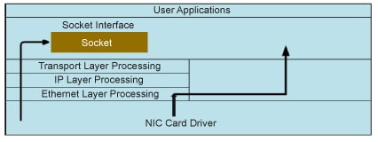

# Raw Socket
- [Raw Socket](#raw-socket)
  - [1. Introduction](#1-introduction)
  - [2. How Raw Sockets Work](#2-how-raw-sockets-work)
  - [3. Different between raw socket and normal socket](#3-different-between-raw-socket-and-normal-socket)
  - [4. Key Features](#4-key-features)
  - [5. Use cases](#5-use-cases)
  - [6. Usage](#6-usage)
  - [7. Note](#7-note)
  - [8. References](#8-references)

## 1. Introduction
Raw socket is a low-level socket that allow direct access to lower-layer network protocol, like TCP, IP protocol, ... It enable you to manually craft packets, bypassing the OS's built-in protocol stack. This gives developers the ability to manipulate protocol headers, craft custom packets, and access network traffic at a granular level.

## 2. How Raw Sockets Work
Raw sockets provide direct access to the network layer (OSI Layer 3) or data link layer (OSI Layer 2) depending on the socket type. By doing this, the OS doesn't automatically add protocol headers like TCP, UDP, or IP headers, allowing you to control packet construction.

The two types of raw sockets are:

- AF_INET (IP-based): Allows access to raw IP packets.
- AF_PACKET (Link Layer): Allows access to the entire Ethernet frame, including the data link layer headers (Ethernet, ARP).

Raw sockets require root or administrator privileges on most systems due to the security implications of sending and receiving crafted packets.

## 3. Different between raw socket and normal socket

- Other sockets like stream sockets and data gram sockets receive data from the transport layer that contains no headers but only the payload. This means that there is no information about the source IP address and MAC address. If applications running on the same machine or on different machines are communicating, then they are only exchanging data.


- On the other hand, a raw socket allows an application to directly access lower level protocols, which means a raw socket receives un-extracted packets.



## 4. Key Features 
- **Direct Control Over Packets:** You can build custom headers and packets at different layers, such as IP, TCP, UDP, and ICMP.
- **Custom Protocol Testing:** It allows testing or experimenting with custom network protocols.
- **Network Layer Access:** Provides access to raw packets at either the network layer or data link layer.
- **Bypass System-Level Networking Stacks:** You can skip the automatic handling of network protocol headers and manage them manually.

## 5. Use cases

Raw Socket are using for several purpose:

1. **Bulding your own packet from scartch:** We can build packets with our own struct, define header, checksum and then send it directly to network 
2. **Packet Sniffing:** Capture and analyze network traffic for monitoring and debugging purposes.
3. **Network Diagnostics and Testing:** Create network diagnostic tools that test various aspects of network communication. Tools like ping and traceroute use raw sockets to send ICMP packets and analyze responses to diagnose network connectivity and latency issues

## 6. Usage
**1. Create a packet with raw socket**

**1.1 At the Network Layer**
```c
#include <sys/socket.h>
#include <netinet/in.h>
#include <stdio.h>

int main() {
    int sock = socket(AF_INET, SOCK_RAW, IPPROTO_ICMP);
    if (sock == -1) {
        perror("Cant create socket");
        return 1;
    }
    printf("Raw socket created");
    return 0;
}
```
- AF_INET: address family for access network layer (IPV4)
- SOCK_RAW: using raw socket
- IPPROTO_ICMP: speicy that working on ICMP protocol
  => This code create a raw socket for ICMP protocol
  
**1.2 At the Datalink Layer**
```c
#include <sys/socket.h>
#include <netinet/in.h>
#include <stdio.h>
#inclue <linux/if_ether.h>

int main() {
    int sock = socket(AF_PACKET, SOCK_RAW, htons(ETH_P_IP));
    if (sock == -1) {
        perror("Cant create socket");
        return 1;
    }
    printf("Raw socket created");
    return 0;
}
```
- AF_PACKET: address family for access datalink-layer
- SOCK_RAW: using raw socket
- htons(ETH_P_IP): specify that we want to work with all packet has IP packet
 
**2. Send a custom packet**
```c
#include <sys/socket.h>
#include <netinet/ip.h>
#include <string.h>

void send_packet(int sock, char *packet, int packet_len) {
    struct sockaddr_in dest;
    dest.sin_family = AF_INET;
    dest.sin_addr.s_addr = inet_addr("8.8.8.8"); //Dest IP addr

    if (sendto(sock, packet, packet_len, 0, (struct sockaddr *)&dest, sizeof(dest)) < 0) {
        perror("Sent fail");
    } else {
        printf("Send packet successful");
    }
}
```
**3. Receive data**
```c
char buffer[65535];
int recv_len = recvfrom(sockfd, buffer, sizeof(buffer), 0, NULL, NULL);
if (recv_len < 0) {
    perror("Receive failed");
}
```

## 7. Note
1. **Access Rights**
- Since i'm using in Linux, always have to run with root
  > sudo ./your_program

2. **Potential Misuse:** Malicious actors can use raw sockets to perform attacks like IP spoofing, DoS (Denial of Service), and packet injection.

3. **Monitoring:** Systems that use raw sockets for packet injection may be flagged by intrusion detection systems (IDS) or other security tools

## 8. References
- [What Are Raw Sockets? | Baeldung on Computer Science ](https://www.baeldung.com/cs/raw-sockets)
- [A Guide to Using Raw Sockets](https://www.opensourceforu.com/2015/03/a-guide-to-using-raw-sockets/)
- [Introduction to RAW-sockets - TUprints.pdf](https://tuprints.ulb.tu-darmstadt.de/6243/1/TR-18.pdf)

